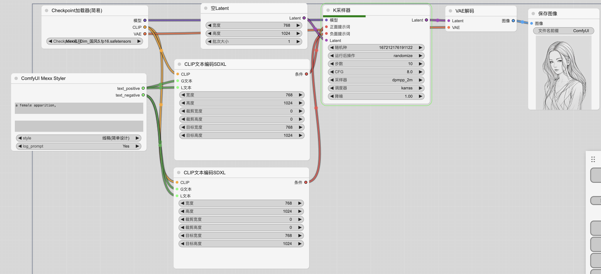
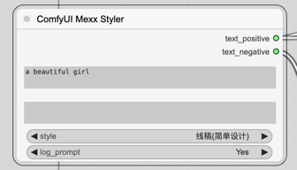

## 风格选择器

## 简单的风格介绍

均以以下提示词出图（为SDXL出图）

宽高: 768 x 1024
采样: dpmpp 2M Karras x 10步

### 摄影棚

### 生活摄影风格

### 模特摄影风格

### 肖像摄影风格

### 富士摄影风格

### 人物抽象插画

### 混合抽象插画

### 黑暗恐怖主题

### 黑暗主题

### 机械朋克主题

尝试使用LCM出图效果如下

### 线稿(复杂设计)

> 时灵时不灵

### 线稿（简单）

> 时灵时不灵

### 复杂细节

