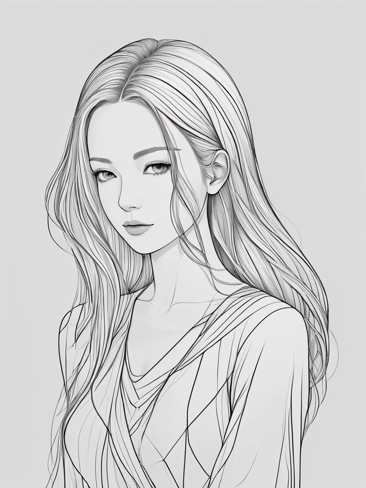

## 风格选择器

Thanks For : https://github.com/twri/sdxl_prompt_styler

## 简单的风格介绍

均以以下提示词出图（为SDXL出图）

宽高: 768 x 1024
采样: dpmpp 2M Karras x 10步

### 摄影棚

### 生活摄影风格

### 模特摄影风格

### 肖像摄影风格

### 富士摄影风格

### 人物抽象插画

### 混合抽象插画

### 黑暗恐怖主题

### 黑暗主题

### 机械朋克主题

尝试使用LCM出图效果如下

### 线稿(复杂设计)

> 时灵时不灵

### 线稿（简单）

> 时灵时不灵

### 复杂细节

## For More

### ComfyUI
1. 将中文翻译英文：https://github.com/SoftMeng/ComfyUI-FanYi
2. 从图片提取自然语言：https://github.com/SoftMeng/ComfyUI_ImageToText
3. 随机生成提示词：https://github.com/SoftMeng/ComfyUI-Prompt
4. 通过HTML模版制作AI海报：https://github.com/SoftMeng/ComfyUI_Mexx_Poster
5. 通过图片模版制作AI海报：https://github.com/SoftMeng/ComfyUI_Mexx_Image_Mask
6. Java工程调用ComfyUI生成AI图片（含全自动图片馆）：https://github.com/SoftMeng/comfy-flow-api
### Stable Diffusion WebUI
1. 随机生成提示词：https://github.com/SoftMeng/stable-diffusion-prompt-pai
### Fooocus
1. 汉化：https://github.com/SoftMeng/Fooocus-zh
### 其他
2. 视频会议：https://github.com/SoftMeng/vue-webrtc